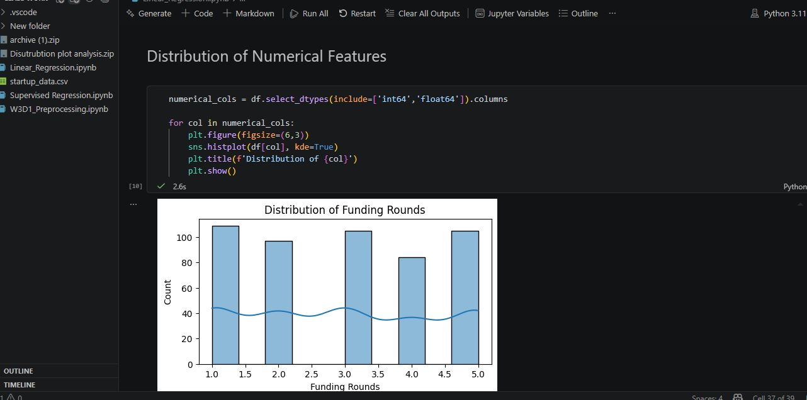
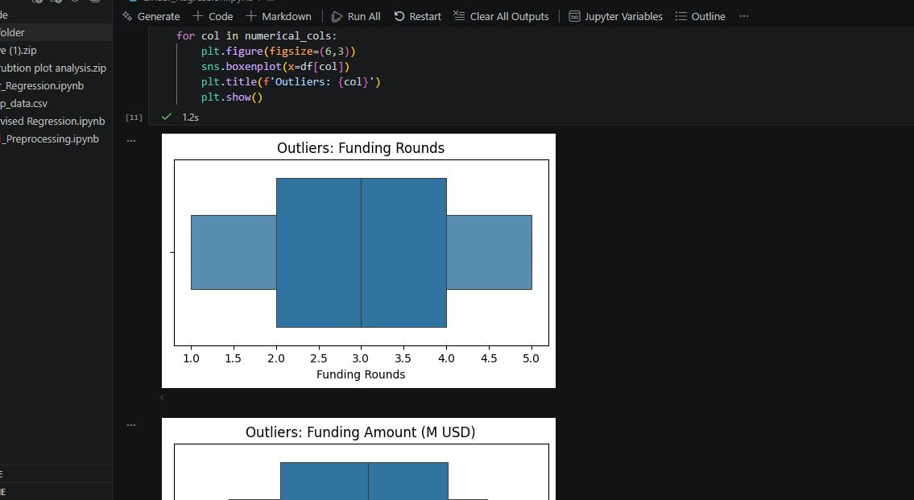
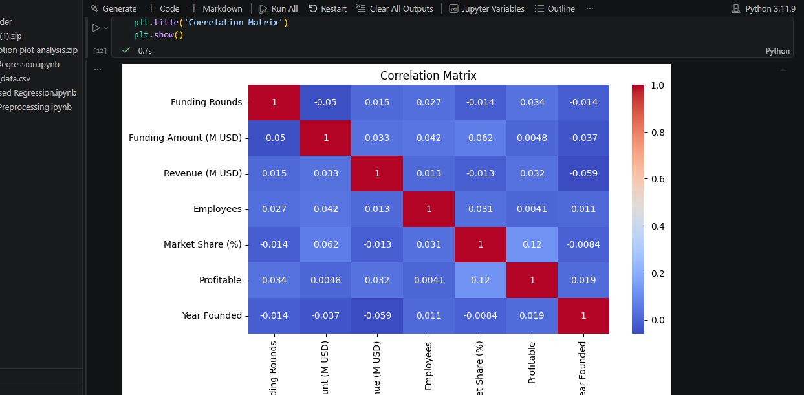
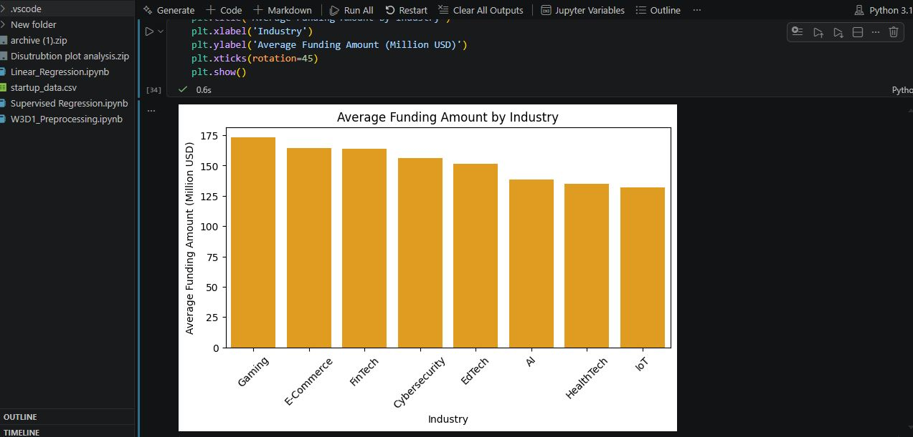

# 📈 Startup Revenue Prediction using Linear Regression

> An end-to-end Machine Learning project that analyzes startup data, extracts business insights through Exploratory Data Analysis (EDA), and builds a Linear Regression model to predict startup revenue.

---

## 📌 Project Overview

Predicting startup revenue is valuable for investors, entrepreneurs, and business analysts. This project applies the complete Machine Learning workflow, from data preprocessing to model evaluation, using Linear Regression.

The objective is not only to build a predictive model but also to understand the relationships between business variables and revenue through data analysis.

---

# 🎯 Objectives

- Perform data cleaning and preprocessing
- Conduct Exploratory Data Analysis (EDA)
- Generate business insights from the dataset
- Analyze feature relationships using a correlation matrix
- Build a Linear Regression model
- Evaluate model performance using regression metrics
- Understand the limitations of Linear Regression on weakly correlated data

---

# 📂 Dataset

**Dataset:** Startup Revenue Dataset

The dataset contains business-related information such as:

- Revenue (Target Variable)
- Funding Amount
- Funding Rounds
- Market Share
- Year Founded
- Employee Count
- Industry
- Other startup-related features

[> *(https://www.kaggle.com/datasets/pranshuljoshi/global-startup-funding-and-valuation-cleaned-dataset/data)*]

---
# 🛠 Technologies Used

- Python
- Pandas
- NumPy
- Matplotlib
- Seaborn
- Scikit-learn
- Jupyter Notebook

---

# 🔍 Exploratory Data Analysis (EDA)

The following analyses were performed:

- Missing Value Analysis
- Duplicate Value Check
- Data Types Inspection
- Statistical Summary
- Distribution Analysis
- Histograms
- Boxplots
- Correlation Heatmap
- barplot

---

# 📊 Business Insights

Some insights discovered during EDA include:

### 📌 Revenue

- Most startups generated revenue between **20M and 80M**.

### 📌 Funding Rounds

- Most startups received between **2 and 4 funding rounds**.

### 📌 Funding Amount

- The majority of startups raised funding between **100M and 200M**.

### 📌 Market Share

- Most startups held a market share between **2% and 4%**.

### 📌 Year Founded

- Most startups were founded between **1995 and 2015**.


---

# 📈 Correlation Analysis

A correlation heatmap was used to understand relationships between numerical variables.

### Key Observation

- Most independent variables showed **weak correlation** with startup Funding Amount.

Because Linear Regression assumes a strong linear relationship between features and the target variable, weak correlations limited the model's predictive performance.

---

# ⚙️ Data Preprocessing

The following preprocessing steps were applied:

- Train-Test Split
- Scaling (StandardScaler)
- Encoding (OneHotEncoder)


---

# 🤖 Machine Learning Model

**Model Used**

- Linear Regression

The model was trained using Scikit-learn's Linear Regression algorithm.

---

# 📉 Model Evaluation

The model was evaluated using regression metrics:

- Mean Absolute Error (MAE)
- Mean Squared Error (MSE)
- Root Mean Squared Error (RMSE)
- R² Score

The Linear Regression model was evaluated using several regression metrics to measure prediction accuracy and error.

| Metric | Value |
|---------|-------:|
| Mean Absolute Error (MAE) | **78.94** |
| Mean Squared Error (MSE) | **8640.54** |
| Root Mean Squared Error (RMSE) | **92.95** |
| R² Score | **-0.0976** |
| Mean Absolute Percentage Error (MAPE) | **239.05%** |


---
## 📌 Why Did the Model Perform Poorly?

The primary reason for the poor performance is that the dataset exhibits **weak linear relationships** between the independent variables and the target variable (Revenue), as observed in the correlation heatmap.

Since Linear Regression assumes a linear relationship between the input features and the target, weak correlations limit its ability to learn meaningful patterns. As a result, the model produces high prediction errors and a negative R² score.

This project demonstrates an important Machine Learning principle:

> **Choosing the right algorithm depends on the characteristics of the data. A poor-performing model can still provide valuable insights into the dataset and guide the selection of more suitable algorithms.**


# 📌 Conclusion

The Linear Regression model did not achieve strong predictive performance because the dataset contained weak linear relationships between the features and the target variable.

This project demonstrates that selecting an appropriate algorithm depends heavily on the underlying characteristics of the data.

Even when a model performs poorly, understanding *why* it performs poorly is an important part of the Machine Learning process.

---

# 📷 Project Screenshots

## Data Distribution

*()*

---

## Boxplots

*()*

---

## Correlation Heatmap



---

## Bar plot 


---

# 📁 Project Structure

```
startup-revenue-linear-regression/
│
├── data/
│   └── startup_data.csv
│
├── notebooks/
│   └── startup_revenue_linear_regression.ipynb
│
├── images/
│   ├── histogram.png
│   ├── boxplot.png
│   ├── heatmap.png
│   └── evaluation.png
│
├── requirements.txt
├── README.md
└── .gitignore
```

---

# ▶️ Installation

Clone the repository

```bash
git clone https://github.com/Muhamad-Waqas/startup-revenue-linear-regression.git
```

Move into the project directory

```bash
cd startup-revenue-linear-regression
```

Install dependencies

```bash
pip install -r requirements.txt
```

Run the notebook

```bash
jupyter notebook
```

---

# 🚀 Future Improvements

- Apply Polynomial Regression
- Try Decision Tree Regression
- Experiment with Random Forest Regression
- Perform Feature Engineering
- Tune Hyperparameters
- Compare multiple regression algorithms

---

# 📚 Key Learnings

Through this project, I learned:

- End-to-end Machine Learning workflow
- Data cleaning and preprocessing
- Exploratory Data Analysis (EDA)
- Business insight generation
- Correlation analysis
- Linear Regression fundamentals
- Regression evaluation metrics
- Model interpretation
- Importance of feature relationships in predictive modeling

---

# 👨‍💻 Author

**Muhammad Waqas**

Computer Science Undergraduate | Aspiring Data Scientist & Machine Learning Engineer

- GitHub: https://github.com/Muhamad-Waqas
- LinkedIn: [ https://linkedin.com/in/yourprofile](https://www.linkedin.com/in/muhammad-waqas-786800343/)

---

## ⭐ If you found this project useful, consider giving it a star!
